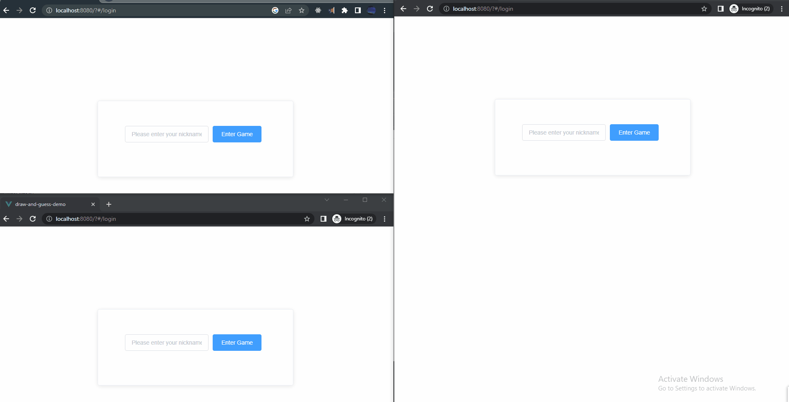

# Pictionary-PlayGroud
Pictionary-PlayGroud

## Project Description
Pictionary is an online drawing game where players take turns drawing a given word and other players try to guess the word based on the drawing. 

### The game is built using the following technologies:
<ol>
  <li>Express.js: a web application framework for Node.js used to build the server-side of the application.</li>
  <li>Socket.io: a library that enables real-time, bidirectional and event-based communication between the server and the client.</li>
  <li>Vue.js: a progressive framework for building user interfaces that's used for the client-side of the application.</li>
  <li>Konva.js: an HTML5 2D drawing library that's used to implement the canvas where players can draw their pictures.</li>
  <li>Element UI: a Vue.js-based UI toolkit used to create the interface components such as buttons and forms.</li>
</ol>

## Potential Improvements
<ol>
  <li>Implement an AI-based drawing recognition feature that can automatically recognize what a player has drawn and assign points based on the accuracy.</li>
  <li>Implement a feature to allow players to save and share their drawings on social media.</li>
  <li>Improve the user interface and make it more visually appealing.</li>
</ol>
